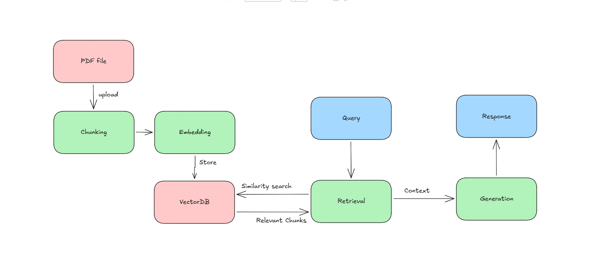

## RAG (Retrieval-Augmented Generation)

Generate LLM response based on the context from the pdf.

#### Tech stack:

- **Language :** Python
- **LLM Model :** Gemini-2.5-flash
- **Framework :** Langchain
- **Vector DB :** ChromaDB
- **Embedding Model :** Gemini-embedding-001
